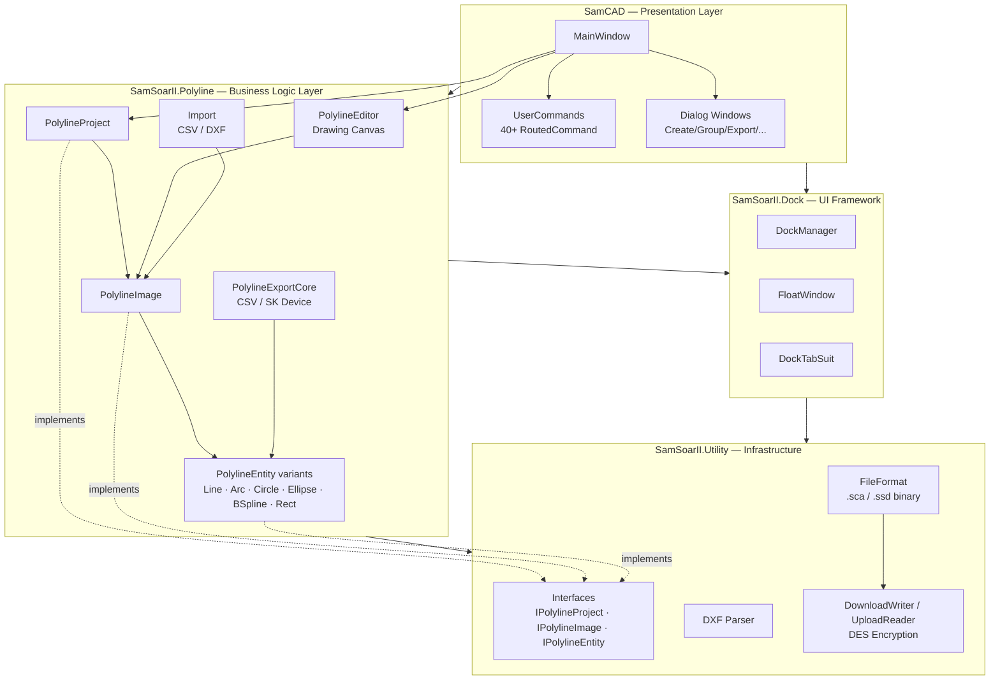
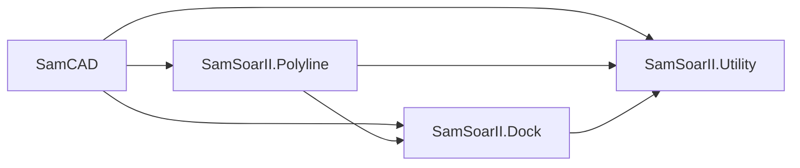
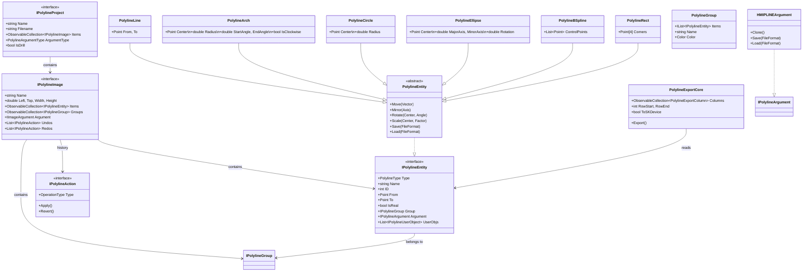
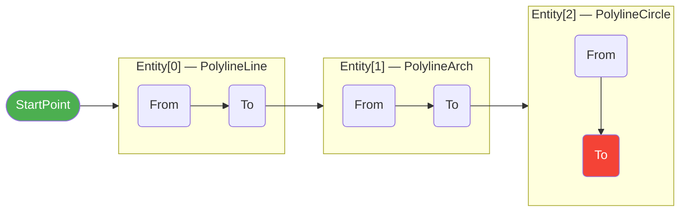
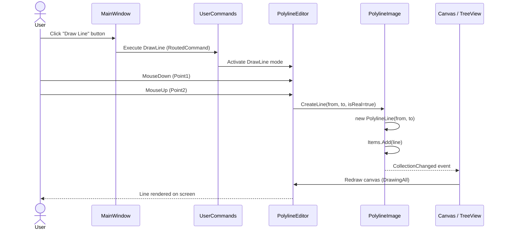
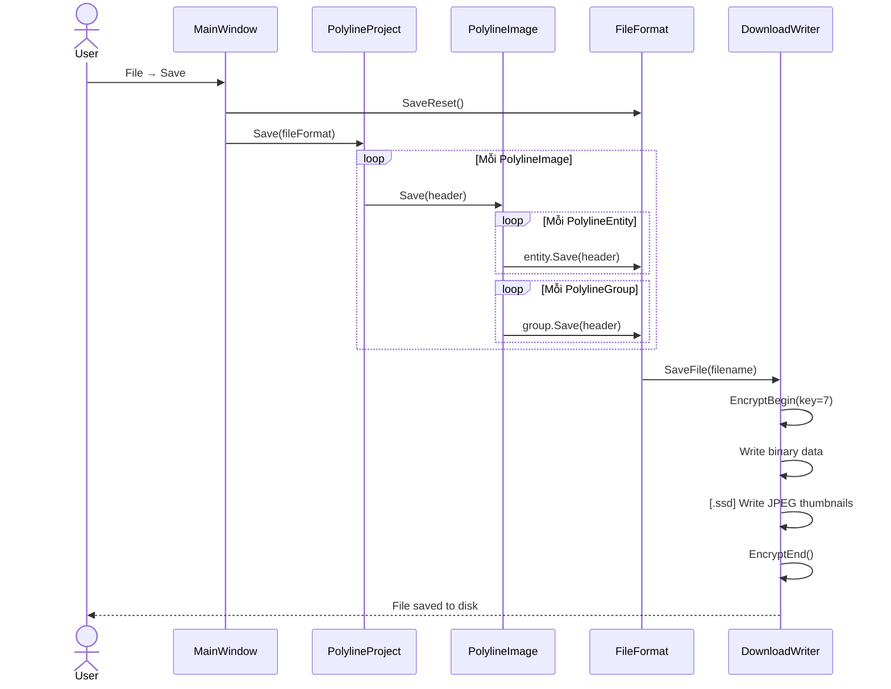
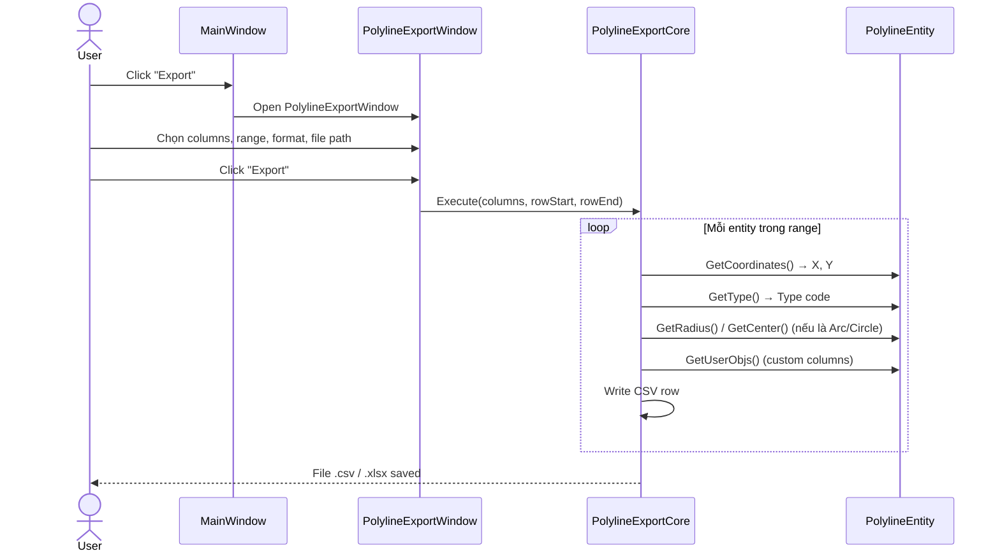

# File dll và exe ở thư mục gốc là phần mềm gốc
# Các file trong thư mục /source là các mã nguồn được biên dịch ngược
# File thực thi được build nằm trong thư mục \SamCAD\source\SamCAD\bin\x86\Release\net40\SamCAD.exe

---

## Mô tả kiến trúc phần mềm

SamCAD là phần mềm CAD chuyên dụng cho lập trình PLC/HMI, cho phép thiết kế đường polyline (tool path) và xuất dữ liệu sang thiết bị SK. Ứng dụng xây dựng trên WPF (.NET Framework 4.0, x86), gồm 4 tầng rõ ràng.

---

### Cấu trúc Solution (6 projects)

| Project | Vai trò |
|---------|---------|
| `SamCAD` | Ứng dụng chính — giao diện WPF, điều phối lệnh người dùng |
| `SamSoarII.Polyline` | Lõi nghiệp vụ — quản lý entity, undo/redo, export/import |
| `SamSoarII.Dock` | Framework dock/float window cho panel và dialog |
| `SamSoarII.Utility` | Interfaces chung, file format, xử lý DXF |
| `SamSoarII.Dock.resources` | BAML resources cho Dock UI |
| `SamSoarII.Utility.resources` | BAML resources cho Utility UI |

---

### Biểu đồ thành phần (Component Diagram)

---

### Biểu đồ phụ thuộc giữa các project

> **Quy tắc:** Tầng trên phụ thuộc tầng dưới, không có phụ thuộc ngược. `SamSoarII.Utility` là lõi không phụ thuộc project nào trong solution.

---

### Mô hình dữ liệu (Class Diagram)

---

### Mô hình chuỗi Polyline (Polyline Chain)

Các entity được lưu dưới dạng **chuỗi liên tục** — điểm cuối của entity trước là điểm đầu của entity tiếp theo.

- `IsReal = true` → **nét cắt** (tool hạ, cắt vật liệu)
- `IsReal = false` → **đường di chuyển ảo** (tool nâng, di chuyển nhanh)

---

### Sequence Diagram: Vẽ một đường thẳng

---

### Sequence Diagram: Lưu project (.sca/.ssd)

---

### Sequence Diagram: Export dữ liệu ra CSV / SK Device

---

### Các design pattern sử dụng

| Pattern | Nơi áp dụng | Mục đích |
|---------|------------|---------|
| **MVVM** | MainWindow ↔ PolylineProject/Image | Data binding, PropertyChanged tự động cập nhật UI |
| **Command** | `UserCommands` (40+ RoutedCommand) | Tách biệt UI trigger khỏi business logic |
| **Undo/Redo** | `IPolylineAction` + Undos/Redos list | Lịch sử thao tác, khôi phục trạng thái |
| **Factory** | Entity creation by `PolylineType` enum | Tạo đúng loại entity (Line/Arc/Circle/...) |
| **Observer** | `INotifyPropertyChanged`, `ObservableCollection` | UI tự cập nhật khi model thay đổi |
| **Strategy** | MatrixStrategy, ReorderingStrategy, FillStrategy | Hoán đổi thuật toán nhân bản/sắp xếp/điền |
| **Repository** | `FileFormat` + `DownloadWriter`/`UploadReader` | Đóng gói toàn bộ logic đọc/ghi file |

---

### Các định dạng file được hỗ trợ

| Định dạng | Mô tả |
|-----------|-------|
| `.sca` | Binary độc quyền của SamCAD, mã hóa DES |
| `.ssd` | Binary + ảnh thumbnail JPEG nhúng kèm |
| `.dxf` | AutoCAD Drawing Exchange Format (import/export) |
| `.csv / .xlsx` | Export dữ liệu điểm ra bảng, nạp vào thiết bị SK |
